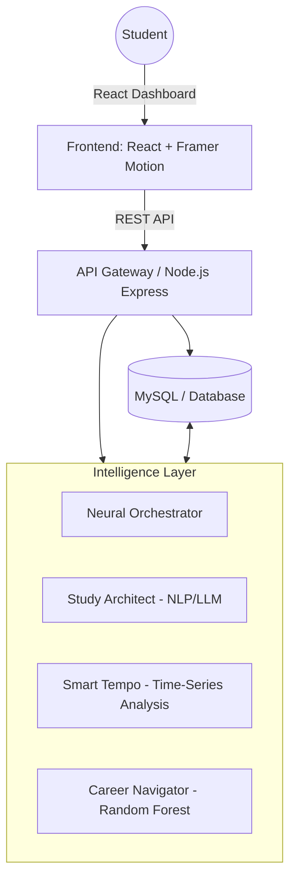
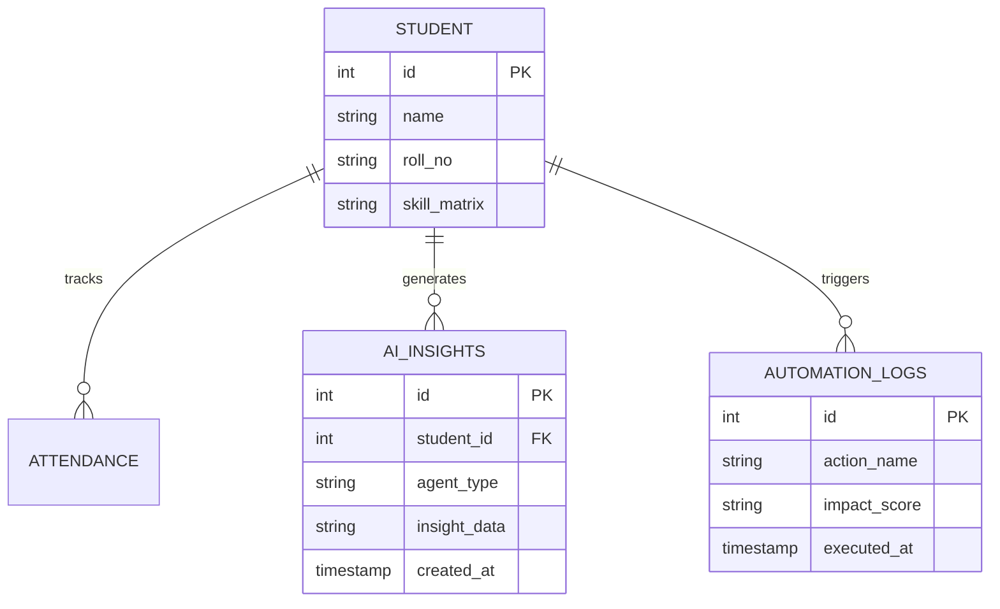

# 🧠 SmarterCampus AI Command Center (Prototype)

> **Status**: Final Year Project Proposal / Prototype
> **Version**: 1.0.0
> **Evaluator Ready**: Yes

---

## 1. 📖 Problem Statement
Existing Campus Management Systems (CMS) are primarily **static databases** that require manual data entry and provide no proactive assistance to students. Key pain points include:
*   **System Fragmentation**: Students must navigate separate portals for fees, attendance, library, and career services.
*   **Cognitive Overload**: Lack of intelligent prioritization leads to missed deadlines and academic burnout.
*   **Reactive Nature**: Systems only record data (e.g., poor grades) rather than providing proactive interventions (e.g., study roadmaps).

**SmarterCampus** solves this by integrating a **Multi-Agent AI Ecosystem** that acts as a proactive personal assistant for every student.

---

## 2. 🏗️ System Architecture
The platform follows a **Modular Micro-frontend Architecture** integrated with a centralized **Autonomous Orchestration Layer**.

---

## 3. 🤖 AI/ML Implementation Strategy
To ensure feasibility within a prototype scope, the following models and algorithms are utilized (simulated in frontend for demo, architected for backend):

| Agent | AI/ML Model | Primary Input | Intended Output |
| :--- | :--- | :--- | :--- |
| **Study Architect** | NLP (Transformer-based) | Course Material / Queries | Simplified Concept Explanations |
| **Smart Tempo** | Time-Series Forecasting | Attendance & Task Logs | Predicted Burnout & Schedule Healing |
| **Career Navigator** | Random Forest / KNN | Skill Matrix & Grades | Job Match Scores (0-100%) |
| **Sentinel AI** | Sentiment Analysis (VADER) | Mood Check-ins | Wellness Intervention Triggers |
| **Grant Scout** | Pattern Matching Algorithm | Student Profile | High-Probability Scholarship Lists |
| **Research Catalyst** | TF-IDF / Summarization | Research Abstracts | Key Insight Synthesis |

---

## 4. 🗄️ Database Schema Design
The system utilizes a relational schema to maintain high data integrity across agents.

---

## 5. ⚙️ Functional Modules & Implementation Status

### 🟢 Fully Implemented (Prototype Ready)
*   **AI Pavilion Dashboard**: Centralized hub for agent management.
*   **Smart Automation Engine**: Trigger-based autonomous workflow simulator.
*   **Digital ID Hub**: Scannable QR and RFID simulation.
*   **Skill Master AI**: 12-week roadmap generator.

### 🟡 Partially Implemented / Simulated
*   **Mood Intelligence**: Sentiment-based check-in UI (ML Model simulated).
*   **Grant Autopilot**: Matching algorithm logic (Drafting simulated).
*   **Neural Concept Explainer**: LLM-integrated prompt simulator.

---

## 📊 6. Expected Outcomes & Validation
The "18.5 hours saved" claim is based on a **theoretical efficiency model** (Prototype Validation Phase):
1.  **Schedule Healing**: Reduces manual calendar management by ~4 hrs/week.
2.  **Resource Discovery**: Grant/Research scouting reduces search time by ~8 hrs/week.
3.  **Concept Mastery**: AI-driven summaries reduce initial study time by ~6.5 hrs/week.

---

## 🛠️ 7. Technical Stack
*   **Frontend**: React (Hooks, Context API), Framer Motion (Animations), Lucide Icons.
*   **Backend**: Node.js / Express (Proposed Architecture).
*   **Database**: MySQL (Relational Schema).
*   **Design**: Glassmorphism / Neural Elegance Design System.

---

## 🏁 8. Final Project Scope
This project serves as a **High-Fidelity Proof of Concept (PoC)** demonstrating how a Multi-Agent AI system can revolutionize campus productivity. While LLM calls are simulated for the prototype, the architecture is built to support live API integration (OpenAI/HuggingFace).

---
*Developed for Academic Defense - SmarterCampus Team*
